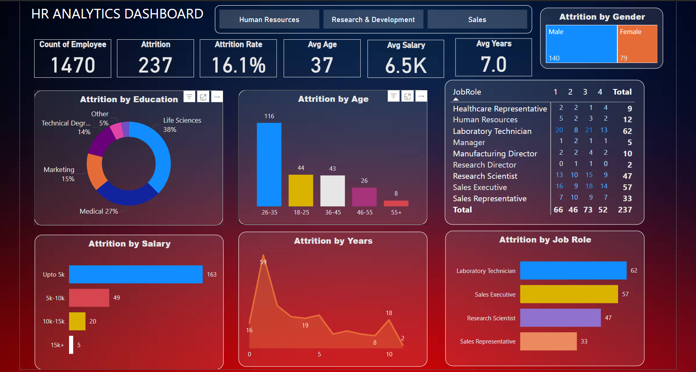

# Power BI Interactive Dashboard - HR Analytics Dashboard with Power BI

## Project Overview

This project demonstrates how to use **Power BI** to create an **interactive HR Analytics Dashboard** that helps organizations analyze key metrics related to employee attrition. 
The dashboard was developed as part of a learning journey in data cleaning, processing, and visualization, with the ultimate goal of transforming raw HR data into actionable insights.



## Key Features

- **Interactive Dashboard**: Visualize HR data in an intuitive, interactive format.
- **Data Cleaning**: Raw data was processed and cleaned to ensure accuracy and relevancy of the insights.
- **Storytelling with Data**: Insights were designed to tell a story, helping decision-makers understand employee trends at a glance.

## Power BI Basics Covered

- **Attrition Rate**: 16.1% overall attrition, with 237 employees leaving out of 1470.
- **Age & Attrition**: The highest attrition rate is among employees aged 26-35, followed by 18-25.
- **Salary Trends**: Employees earning under $5K/month show the highest turnover (163 employees).
- **Job Roles**: Laboratory Technicians, Sales Executives, and Research Scientists experience the most attrition.
- **Education**: Life Sciences (38%) and Medical (27%) fields show the highest rates of employee exits.
- **Gender**: Males are more likely to leave than females, with 140 male exits compared to 79 female exits.


## Technologies Used

- **Power BI**: Used to clean, process, and visualize the HR data in an interactive dashboard.
- **Data Processing**: Implemented data cleaning techniques to prepare the data for analysis.
- **Visualization**: Created compelling visual elements (bar charts, pie charts, and more) to present insights in a digestible format.


## Installation and Setup

1. Download **Power BI Desktop** from [here](https://powerbi.microsoft.com/desktop/).
2. Clone this repository:
    ```bash
    git clone https://github.com/your-username/madhav-store-powerbi-dashboard.git
    ```
3. Open the `.pbix` file in **Power BI Desktop**.
4. Explore the dashboard and interact with filters and slicers.

## How to Use the Dashboard

- **State-wise Analysis**: Click on the state slicer to view sales specific to that region.
- **Category-wise Insights**: Use the category filter to analyze sales based on product categories like clothing, electronics, etc.
- **Quarterly Trends**: Filter sales performance by quarters to identify patterns in different periods.
- **Payment Mode Analysis**: Understand customer payment preferences using the payment mode pie chart.

## Project Learnings

- **Data Cleaning**: Effective data cleaning is key to generating accurate and actionable insights.
- **Data Visualization**: Presenting complex data through visuals helps stakeholders understand patterns and trends easily.
- **Storytelling**: It's not just about the data; it's about creating a narrative that drives decision-making.

## Future Enhancements
- Add more interactivity with drill-down features for deeper analysis.
- Integrate with live data sources for real-time analytics.
- Expand the dashboard to include predictive analytics for attrition forecasting.

## Conclusion

This Power BI dashboard provides the Madhav Store owner with actionable insights to optimize their online sales strategy, improve inventory management, and understand customer preferences. 

Feel free to reach out for any feedback or collaboration opportunities!

## License

This project is licensed under the MIT License - see the [LICENSE](LICENSE) file for details.

## Contact

For more details or collaboration:
- **Name**: Punu N Gowda
- **Email**: punungowda6@gmail.com
- **LinkedIn**: [Punu N Gowda](https://www.linkedin.com/in/punungowda/)
